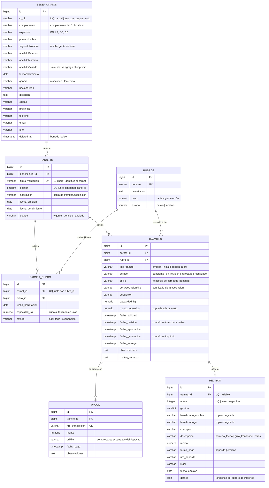
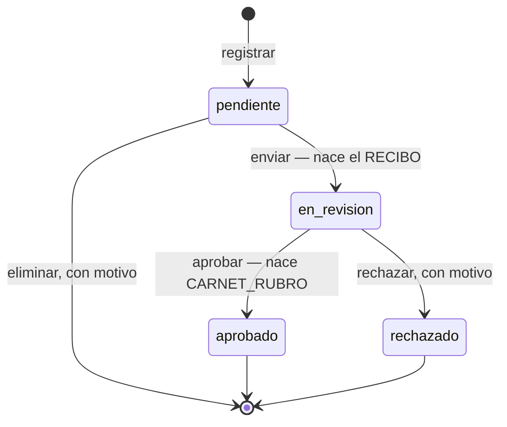
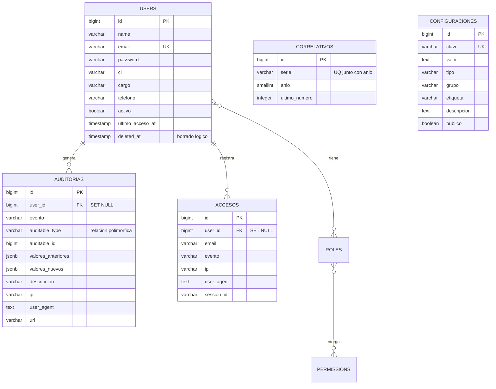

# Modelo Entidad-Relación — Jichi

Sistema de carnets de pesca del Gobierno Autónomo Departamental del Beni.
PostgreSQL 18. Generado desde el esquema real (`storage/app/jichi-esquema.sql`).

Las 24 tablas de la base se dividen en tres grupos:

| Grupo | Tablas | Qué son |
| --- | --- | --- |
| **Dominio** | `beneficiarios`, `rubros`, `carnets`, `carnet_rubro`, `tramites`, `pagos`, `recibos` | El negocio. Son las que se modelan acá |
| **Soporte** | `users`, `correlativos`, `configuraciones`, `auditorias`, `accesos` | Operación del sistema |
| **Infraestructura** | `roles`, `permissions`, `model_has_roles`, `model_has_permissions`, `role_has_permissions`, `cache`, `cache_locks`, `jobs`, `job_batches`, `failed_jobs`, `sessions`, `migrations` | Laravel y el paquete de permisos. No son del negocio |

---

## 1. Diagrama del dominio



### Cómo se lee

| Relación | Cardinalidad | En palabras |
| --- | --- | --- |
| `beneficiarios` → `carnets` | 1 : 0..N | Una persona tiene un carnet **por gestión**. Varios años, varios carnets; el mismo año, uno solo |
| `carnets` ↔ `rubros` | N : M vía `carnet_rubro` | Un carnet habilita varios rubros; un rubro está en muchos carnets |
| `carnets` → `tramites` | 1 : 0..N | Cada rubro pedido es un trámite distinto colgado del mismo carnet |
| `rubros` → `tramites` | 1 : 0..N | Un trámite pide exactamente un rubro |
| `tramites` → `pagos` | 1 : 0..N | Un trámite se cubre con uno o varios depósitos |
| `tramites` → `recibos` | 1 : 0..1 | Un solo recibo por trámite, y recién al enviarlo a revisión |

`carnet_rubro` es la entidad asociativa que resuelve el N:M, pero **no es un pivote pelado**: tiene identidad propia (`id`), atributos propios (`fecha_habilitacion`, `capacidad_kg`, `estado`) y es la fila que *nace* cuando se aprueba un trámite. Es la habilitación misma.

---

## 2. Las reglas que el modelo impone

Lo que hace interesante a este MER no son las claves foráneas sino las restricciones de unicidad. Cada una es una regla del negocio escrita en la base, no en el código.

| Restricción | Tabla | Regla que garantiza |
| --- | --- | --- |
| `carnets_beneficiario_gestion_unique (beneficiario_id, gestion)` | `carnets` | **Una persona, un carnet por año.** Es la regla que ordena todo el sistema |
| `carnets_firma_validacion_unique` | `carnets` | El carnet **no tiene número**: se identifica por su firma de 16 caracteres, que además es la llave de la verificación pública |
| `carnet_rubro_unico (carnet_id, rubro_id)` | `carnet_rubro` | No se habilita dos veces el mismo rubro en el mismo carnet |
| `recibos_serie_unica (gestion, numero)` | `recibos` | Numeración del talonario sin saltos ni repetidos dentro del año |
| `recibos_tramite_id_unique` | `recibos` | Un recibo por trámite. Una reimpresión sale con el **mismo** número |
| `pagos_nro_transaccion_unique` | `pagos` | El mismo depósito no se carga dos veces |
| `rubros_nombre_unique` | `rubros` | No hay dos rubros con el mismo nombre |
| `correlativos_serie_anio_unique` | `correlativos` | Fuente del número de recibo: una fila por serie y año |
| `beneficiarios_ci_unico` | `beneficiarios` | Un CI + complemento por persona — tiene truco, ver abajo |

### El índice de `beneficiarios` es parcial, y tiene que serlo

```sql
CREATE UNIQUE INDEX beneficiarios_ci_unico
    ON beneficiarios (ci_nit, COALESCE(complemento, ''))
    WHERE deleted_at IS NULL;
```

Dos detalles que no se ven a simple vista:

- **`WHERE deleted_at IS NULL`** en lugar de meter `deleted_at` dentro del `UNIQUE`. En SQL `NULL != NULL`, así que un índice sobre `(ci_nit, deleted_at)` no bloquearía nada: todos los registros activos tienen `deleted_at` en NULL y el motor los considera distintos entre sí. El índice parcial solo mira los vivos.
- **`COALESCE(complemento, '')`** porque el complemento del CI boliviano es opcional, y sin eso dos personas con el mismo CI y complemento NULL tampoco chocarían.

---

## 3. Borrado: qué se cae y qué resiste

Las claves foráneas no son todas iguales, y ahí se lee el valor que el sistema le da a cada cosa.

| Clave foránea | Acción | Por qué |
| --- | --- | --- |
| `carnets.beneficiario_id` → `beneficiarios` | `RESTRICT` | No se borra a alguien que tiene carnets emitidos |
| `tramites.carnet_id` → `carnets` | `RESTRICT` | No se borra un carnet con expedientes |
| `tramites.rubro_id` → `rubros` | `RESTRICT` | No se borra un rubro que alguien solicitó |
| `carnet_rubro.rubro_id` → `rubros` | `RESTRICT` | Ni uno que está habilitado |
| `carnet_rubro.carnet_id` → `carnets` | `CASCADE` | La habilitación no existe sin su carnet |
| `pagos.tramite_id` → `tramites` | `CASCADE` | El pago no existe sin su trámite |
| `recibos.tramite_id` → `tramites` | `SET NULL` | **El recibo sobrevive al trámite**: guarda su copia congelada de nombre, CI y monto |
| `auditorias.user_id` → `users` | `SET NULL` | El registro histórico no se borra con el usuario |
| `accesos.user_id` → `users` | `SET NULL` | Ídem |

Esos `SET NULL` son el patrón de **documento emitido**: lo que ya salió impreso y está en la calle no puede cambiar ni desaparecer porque se modifique el registro que lo originó.

---

## 4. Desnormalización deliberada

Hay campos repetidos a propósito. No son un error de diseño: son copias congeladas al momento de emitir.

| Campo copiado | Viene de | Cuándo se copia | Por qué |
| --- | --- | --- | --- |
| `tramites.monto_requerido` | `rubros.costo` | Al registrar el trámite | Si mañana sube la tarifa, el trámite viejo sigue debiendo lo que decía cuando se presentó |
| `carnets.asociacion` | `tramites.asociacion` | Al emitir el carnet | Queda impreso en el plástico |
| `carnet_rubro.capacidad_kg` | `tramites.capacidad_kg` | Al aprobar | El cupo autorizado es el de esa aprobación, no el de la siguiente |
| `recibos.beneficiario_nombre`, `beneficiario_ci`, `monto`, `detalle` | `beneficiarios` y `pagos` | Al emitir el recibo | El papel que se llevó el pescador dice eso, y tiene que poder reimprimirse idéntico años después |

La regla general: **un documento emitido guarda su propio texto**, no una referencia a algo que puede cambiar.

---

## 5. Estados: los dominios de valores

Todos van en columnas `varchar`, nunca en tipos `ENUM` nativos de PostgreSQL — así agregar un estado no exige `ALTER TYPE` ni bloquear la tabla. Los valores válidos los definen los enums de PHP en `app/Enums/`.

| Tabla.columna | Valores | Enum |
| --- | --- | --- |
| `tramites.estado` | `pendiente`, `en_revision`, `aprobado`, `rechazado` | `EstadoTramite` |
| `tramites.tipo_tramite` | `emision_inicial`, `adicion_rubro` | `TipoTramite` |
| `carnets.estado` | `vigente`, `vencido`, `anulado` | `EstadoCarnet` |
| `carnet_rubro.estado` | `habilitado`, `suspendido` | `EstadoHabilitacion` |
| `rubros.estado` | `activo`, `inactivo` | `EstadoRubro` |
| `recibos.forma_pago` | `deposito`, `efectivo` | `FormaPago` |
| `recibos.descripcion` | `permiso_faena`, `importe_alevines`, `aprovechamiento_pesquero`, `guia_transporte`, `cedulas`, `otros` | `ConceptoRecibo` |

### El ciclo de vida del trámite



`pendiente` es un **borrador**, y eso explica qué se puede hacer en cada estado: se edita y se elimina, pero no se aprueba ni se rechaza. El salto directo `pendiente → aprobado` no existe, a propósito: con él, quien carga la solicitud podría aprobarla sin que nadie más la mire.

**Impreso y entregado no son estados sino fechas** — `fecha_generacion` y `fecha_entrega`. Un estado obligaría a sincronizar dos columnas que pueden contradecirse; una fecha en NULL dice «todavía no pasó» y no hay forma de que mienta.

---

## 6. Diagrama de soporte



`auditorias` usa una **relación polimórfica** (`auditable_type` + `auditable_id`): apunta a cualquier modelo del sistema sin necesidad de una clave foránea por tabla. Por eso no tiene flechas hacia el dominio en el diagrama — esa integridad la sostiene la aplicación, no el motor.

`correlativos` y `configuraciones` son **tablas sueltas**, sin relaciones. La primera es el contador del talonario de recibos; la segunda, pares clave-valor con los parámetros del sistema.

---

## 7. El recorrido completo, un paso por línea

1. Se registra un **beneficiario**, o se busca uno existente por CI.
2. Se presenta un **trámite** pidiendo un **rubro**. El sistema decide solo si es `emision_inicial` —y crea el **carnet**— o `adicion_rubro` —y reutiliza el del año en curso—.
3. Se cargan uno o más **pagos** con su boleta escaneada, hasta cubrir `monto_requerido`.
4. Se **envía a revisión**: en la misma transacción nace el **recibo** numerado, y el pescador se va con ese papel.
5. Se **aprueba**: nace la fila en **carnet_rubro** y recién ahí la persona queda habilitada.
6. Se **imprime** el carnet (`fecha_generacion`) y se **entrega** (`fecha_entrega`).

---

Ver también: [ARQUITECTURA.md](ARQUITECTURA.md) · [modulos/CARNETS.md](modulos/CARNETS.md) · [modulos/RECIBOS.md](modulos/RECIBOS.md)
