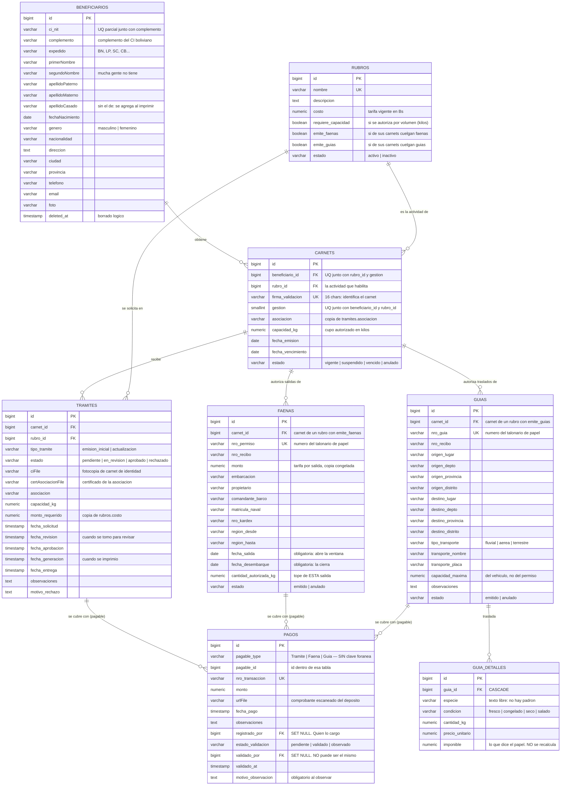
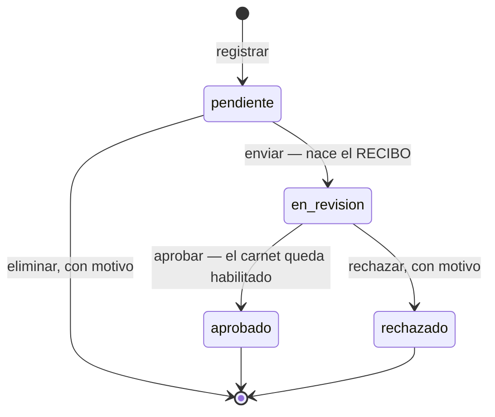
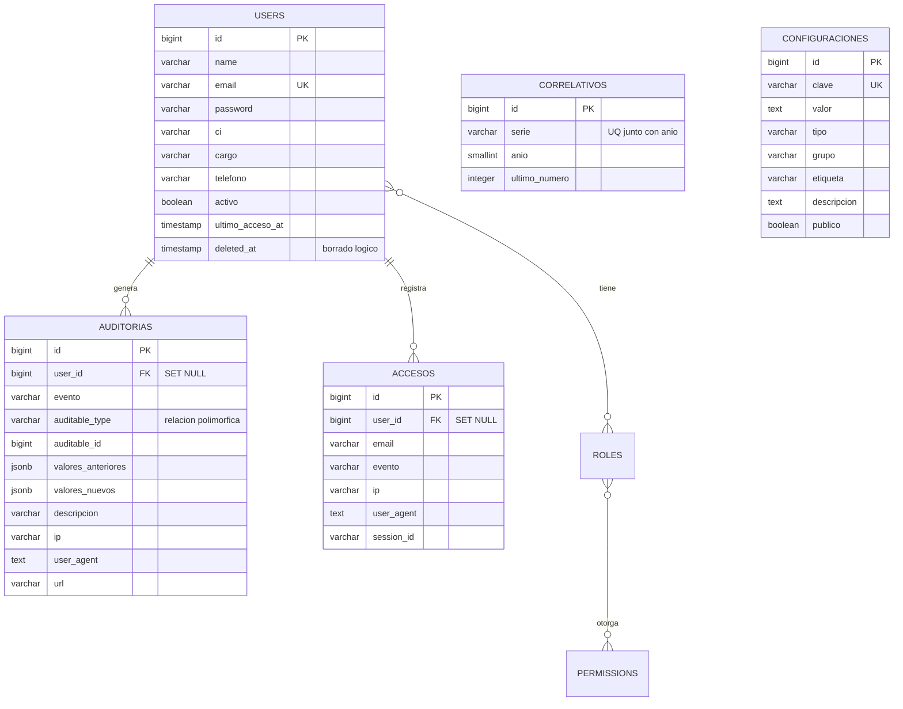

# Modelo Entidad-Relación — Jichi

Sistema de carnets de pesca del Gobierno Autónomo Departamental del Beni.
PostgreSQL 18. Generado desde el esquema real (`storage/app/jichi-esquema.sql`).

Las 27 tablas de la base se dividen en tres grupos:

| Grupo | Tablas | Qué son |
| --- | --- | --- |
| **Dominio** | `beneficiarios`, `rubros`, `carnets`, `tramites`, `pagos`, `faenas`, `guias`, `guia_detalles` | El negocio. Son las que se modelan acá |
| **Soporte** | `users`, `correlativos`, `configuraciones`, `auditorias`, `accesos` | Operación del sistema |
| **Infraestructura** | `roles`, `permissions`, `model_has_roles`, `model_has_permissions`, `role_has_permissions`, `cache`, `cache_locks`, `jobs`, `job_batches`, `failed_jobs`, `sessions`, `migrations` | Laravel y el paquete de permisos. No son del negocio |

---

## 1. Diagrama del dominio



### Cómo se lee

| Relación | Cardinalidad | En palabras |
| --- | --- | --- |
| `beneficiarios` → `carnets` | 1 : 0..N | Una persona tiene un carnet **por gestión**. Varios años, varios carnets; el mismo año, uno solo |
| `rubros` → `carnets` | 1 : N | Un carnet habilita UNA actividad; una actividad tiene muchos carnets emitidos |
| `carnets` → `tramites` | 1 : 0..N | Cada rubro pedido es un trámite distinto colgado del mismo carnet |
| `rubros` → `tramites` | 1 : 0..N | Un trámite pide exactamente un rubro |
| `tramites` → `pagos` | 1 : 0..N | Un trámite se cubre con uno o varios depósitos |
| `carnets` → `faenas` | 1 : 0..N | Un carnet de Pescador autoriza muchas salidas al año, una por faena |
| `carnets` → `guias` | 1 : 0..N | Un carnet de Comercializador ampara muchos traslados al año |
| `guias` → `guia_detalles` | 1 : N | Una guía traslada varias especies, cada una con su condición y sus kilos |
| `faenas` → `pagos` | 1 : 0..N | Se cobran como el trámite: uno o varios depósitos |
| `guias` → `pagos` | 1 : 0..N | Ídem |
| `tramites` → *recibo* | 1 : 0..1 | **Sin tabla.** El comprobante se arma al vuelo; existe desde que hay `fecha_revision` |

**`pagos` ES POLIMÓRFICA, Y ESO SIGNIFICA QUE PERDIÓ SU CLAVE FORÁNEA.** Las tres cosas que se cobran —el trámite, la faena y la guía— se pagan igual: uno o varios depósitos, cada uno con su boleta y su número de transacción. Modelarlas con tres tablas obligaría a triplicar el índice único de `nro_transaccion`, y entonces DEJARÍA de ser único: la misma boleta podría pagar un trámite y una faena, que es justo el fraude que ese índice viene a frenar.

El costo es real y hay que tenerlo presente: **el motor ya no puede garantizar que `pagable_id` apunte a algo que existe**, ni impedir que se borre lo pagado. Por eso las tres tablas de destino van con `RESTRICT` hacia arriba y ninguna se borra en el uso normal. Esa integridad la sostiene la aplicación, igual que en `auditorias`.

**Acá había un N:M y ya no lo hay** (esto es aparte, y es historia). `carnets` ↔ `rubros` se resolvía con una entidad asociativa, `carnet_rubro`. Al pasar a **un carnet por rubro**, esa entidad quedó sin razón de ser: sus atributos son los del carnet, y su clave `(carnet_id, rubro_id)` es redundante con la del carnet. Se eliminó, y con ella el enum `EstadoHabilitacion`, cuyos dos valores se absorbieron en `EstadoCarnet`. **El carnet ES la habilitación.**

---

## 2. Las reglas que el modelo impone

Lo que hace interesante a este MER no son las claves foráneas sino las restricciones de unicidad. Cada una es una regla del negocio escrita en la base, no en el código.

| Restricción | Tabla | Regla que garantiza |
| --- | --- | --- |
| `carnets_beneficiario_rubro_gestion_unique (beneficiario_id, rubro_id, gestion)` | `carnets` | **Una persona, un carnet por actividad y por año.** Es la regla que ordena todo el sistema |
| `carnets_firma_validacion_unique` | `carnets` | El carnet **no tiene número**: se identifica por su firma de 16 caracteres, que además es la llave de la verificación pública |
| `pagos_nro_transaccion_unique` | `pagos` | El mismo depósito no se carga dos veces |
| `faenas_nro_permiso_unique` | `faenas` | Dos faenas con el mismo número serían dos papeles que dicen ser el mismo, y en un control nadie sabría cuál vale |
| `guias_nro_guia_unique` | `guias` | Ídem para la guía de transporte |
| `rubros_nombre_unique` | `rubros` | No hay dos rubros con el mismo nombre |
| `correlativos_serie_anio_unique` | `correlativos` | Fuente del número de recibo: una fila por serie y año |
| `beneficiarios_ci_unico` | `beneficiarios` | Un CI + complemento por persona — tiene truco, ver abajo |

### El índice de `beneficiarios` es parcial, y tiene que serlo

```sql
CREATE UNIQUE INDEX beneficiarios_ci_unico
    ON beneficiarios (ci_nit, COALESCE(complemento, ''))
    WHERE deleted_at IS NULL;
```

Dos detalles que no se ven a simple vista:

- **`WHERE deleted_at IS NULL`** en lugar de meter `deleted_at` dentro del `UNIQUE`. En SQL `NULL != NULL`, así que un índice sobre `(ci_nit, deleted_at)` no bloquearía nada: todos los registros activos tienen `deleted_at` en NULL y el motor los considera distintos entre sí. El índice parcial solo mira los vivos.
- **`COALESCE(complemento, '')`** porque el complemento del CI boliviano es opcional, y sin eso dos personas con el mismo CI y complemento NULL tampoco chocarían.

---

## 3. Borrado: qué se cae y qué resiste

Las claves foráneas no son todas iguales, y ahí se lee el valor que el sistema le da a cada cosa.

| Clave foránea | Acción | Por qué |
| --- | --- | --- |
| `carnets.beneficiario_id` → `beneficiarios` | `RESTRICT` | No se borra a alguien que tiene carnets emitidos |
| `tramites.carnet_id` → `carnets` | `RESTRICT` | No se borra un carnet con expedientes |
| `tramites.rubro_id` → `rubros` | `RESTRICT` | No se borra un rubro que alguien solicitó |
| `carnets.rubro_id` → `rubros` | `RESTRICT` | Ni uno con carnets emitidos: el catálogo se inactiva, no se borra |
| `faenas.carnet_id` → `carnets` | `RESTRICT` | Una faena circuló por el río: no se borra con el carnet |
| `guias.carnet_id` → `carnets` | `RESTRICT` | Ídem: la guía acompañó carga real |
| `guia_detalles.guia_id` → `guias` | `CASCADE` | La única cascada del módulo: el detalle no vale sin su guía, y el formulario reescribe la grilla entera |
| `pagos.pagable_id` → *(nada)* | **sin clave foránea** | Es polimórfica. Lo cubren los `RESTRICT` de arriba, no el motor |
| `pagos.registrado_por` → `users` | `SET NULL` | El usuario se da de baja y el depósito tiene que seguir siendo legible |
| `pagos.validado_por` → `users` | `SET NULL` | Ídem. **No puede ser el mismo que `registrado_por`**, y eso lo impide el servicio, no la base |
| `auditorias.user_id` → `users` | `SET NULL` | El registro histórico no se borra con el usuario |
| `accesos.user_id` → `users` | `SET NULL` | Ídem |

Esos `SET NULL` son el patrón de **documento emitido**: lo que ya salió impreso y está en la calle no puede cambiar ni desaparecer porque se modifique el registro que lo originó.

---

## 4. Desnormalización deliberada

Hay campos repetidos a propósito. No son un error de diseño: son copias congeladas al momento de emitir.

| Campo copiado | Viene de | Cuándo se copia | Por qué |
| --- | --- | --- | --- |
| `tramites.monto_requerido` | `rubros.costo` | Al registrar el trámite | Si mañana sube la tarifa, el trámite viejo sigue debiendo lo que decía cuando se presentó |
| `carnets.asociacion` | `tramites.asociacion` | Al emitir el carnet | Queda impreso en el plástico |
| `carnets.capacidad_kg` | `tramites.capacidad_kg` | **Solo al aprobar** | El cupo autorizado es el de esa aprobación. Lo que venga en blanco NO pisa lo que ya había |
| `carnets.asociacion` | `tramites.asociacion` | **Solo al aprobar** | Igual que el cupo: el carnet nace en NULL y se llena con la primera firma |

**Las dos columnas de `capacidad_kg` no son el mismo dato.** `tramites` guarda lo **pedido**; `carnets`, lo **autorizado**. Entre el registro y la aprobación valen cosas distintas: quien tiene 600 kg autorizados y pide 850 sigue rigiendo por 600 hasta que se cobre y se firme. Con una sola columna, el pedido pisaría al vigente antes de pagarse — y un rechazo posterior no tendría a dónde volver.

La regla general: **un documento emitido guarda su propio texto**, no una referencia a algo que puede cambiar.

---

## 5. Estados: los dominios de valores

Todos van en columnas `varchar`, nunca en tipos `ENUM` nativos de PostgreSQL — así agregar un estado no exige `ALTER TYPE` ni bloquear la tabla. Los valores válidos los definen los enums de PHP en `app/Enums/`.

| Tabla.columna | Valores | Enum |
| --- | --- | --- |
| `tramites.estado` | `pendiente`, `en_revision`, `aprobado`, `rechazado` | `EstadoTramite` |
| `tramites.tipo_tramite` | `emision_inicial`, `actualizacion` | `TipoTramite` |
| `carnets.estado` | `vigente`, `vencido`, `anulado` | `EstadoCarnet` |
| `rubros.estado` | `activo`, `inactivo` | `EstadoRubro` |
| `faenas.estado` | `emitido`, `anulado` | `EstadoPermiso` |
| `guias.estado` | `emitido`, `anulado` | `EstadoPermiso` (el mismo) |
| `guias.tipo_transporte` | `fluvial`, `aerea`, `terrestre` | `TipoTransporte` |
| `guia_detalles.condicion` | `fresco`, `congelado`, `seco`, `salado` | `CondicionProducto` |
| `pagos.estado_validacion` | `pendiente`, `validado`, `observado` | `EstadoValidacionPago` |
| `pagos.pagable_type` | `App\Models\Tramite`, `App\Models\Faena`, `App\Models\Guia` | *(sin enum: lo escribe Eloquent)* |

**`EstadoPermiso` tiene DOS valores y esa pobreza es deliberada.** Un trámite recorre un circuito porque es un expediente; una faena y una guía se llenan en el mostrador, se cobran y se entregan en el acto — nacen valiendo. Y se ANULAN en vez de borrarse: el número salió de un talonario de papel, ya se gastó, y un hueco en la serie no se puede explicar después.

### El ciclo de vida del trámite



`pendiente` es un **borrador**, y eso explica qué se puede hacer en cada estado: se edita y se elimina, pero no se aprueba ni se rechaza. El salto directo `pendiente → aprobado` no existe, a propósito: con él, quien carga la solicitud podría aprobarla sin que nadie más la mire.

**Impreso y entregado no son estados sino fechas** — `fecha_generacion` y `fecha_entrega`. Un estado obligaría a sincronizar dos columnas que pueden contradecirse; una fecha en NULL dice «todavía no pasó» y no hay forma de que mienta.

---

## 6. Diagrama de soporte



`auditorias` usa una **relación polimórfica** (`auditable_type` + `auditable_id`): apunta a cualquier modelo del sistema sin necesidad de una clave foránea por tabla. Por eso no tiene flechas hacia el dominio en el diagrama — esa integridad la sostiene la aplicación, no el motor.

`correlativos` y `configuraciones` son **tablas sueltas**, sin relaciones. La segunda son pares clave-valor con los parámetros del sistema. La primera es un contador genérico que hoy **nadie usa**: alimentaba la serie del talonario de recibos y quedó libre al retirarse esa tabla. No se borró porque un correlativo es justamente el dato que no se puede derivar — ver `CorrelativoService`.

> **NO HAY TABLA `recibos`.** El comprobante se ARMA al vuelo con los datos de
> `beneficiarios`, `carnets`, `rubros`, `tramites` y `pagos` cada vez que
> alguien lo imprime; su número es el id del trámite y su fecha es
> `tramites.fecha_revision`. Ver `App\Support\ReciboArmado`, que explica qué se
> gana y qué se pierde con eso.

---

## 7. El recorrido completo, un paso por línea

1. Se registra un **beneficiario**, o se busca uno existente por CI.
2. Se presenta un **trámite** pidiendo un **rubro**. El sistema decide solo si es `emision_inicial` —y crea el **carnet de ese rubro**— o `actualizacion` —y reutiliza el que ya existe—.
3. Se cargan uno o más **pagos** con su boleta escaneada, hasta cubrir `monto_requerido`.
4. Se **envía a revisión**: en la misma transacción nace el **recibo** numerado, y el pescador se va con ese papel.
5. Se **aprueba**: el cupo y la asociación se consolidan en el **carnet** y recién ahí la persona queda habilitada.
6. Se **imprime** el carnet (`fecha_generacion`) y se **entrega** (`fecha_entrega`).

Y ahí **recién empieza el trabajo de todos los días**, que es lo que el carnet habilita:

7. Con un carnet de **Pescador** vigente se emite una **faena** por cada salida: embarcación, comandante, de tal día a tal día, con tanto autorizado en kilos.
8. Con un carnet de **Comercializador** vigente se emite una **guía** por cada carga trasladada, con su **detalle** especie por especie.
9. Las dos se cobran con **pagos**, la misma tabla que cubre el trámite.
10. **Cada depósito se controla**: alguien abre la boleta, la compara contra el extracto del banco y la VALIDA u OBSERVA. Un trámite con alguna boleta sin controlar no se puede aprobar.

Qué puede emitir cada carnet lo dicen `rubros.emite_faenas` y `rubros.emite_guias`, **nunca el nombre del rubro**: el catálogo lo edita la unidad desde el panel y el mismo rubro figura como «Pescador» o como «Faena» según quién lo cargó.

---

Ver también: [ARQUITECTURA.md](ARQUITECTURA.md) · [modulos/CARNETS.md](modulos/CARNETS.md) · [modulos/RECIBOS.md](modulos/RECIBOS.md)
